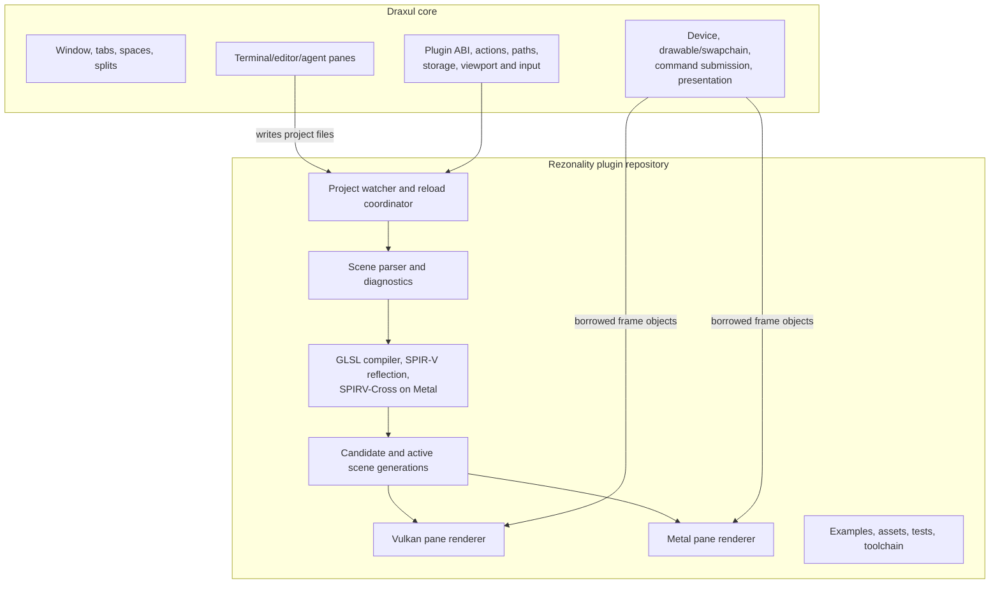
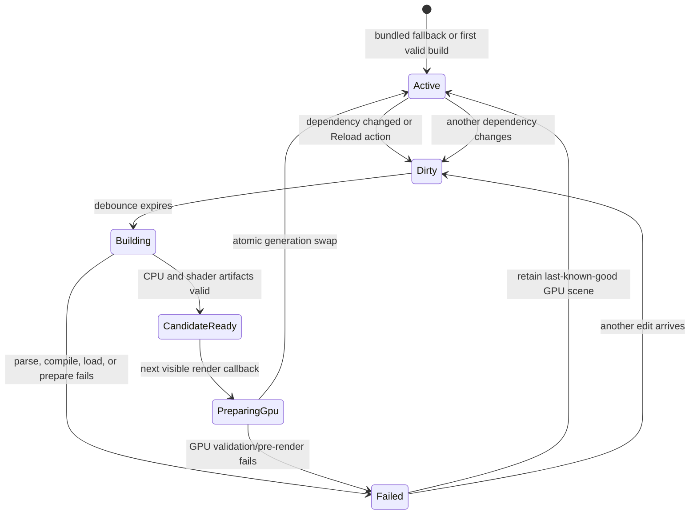

# Rezonality Draxul plugin port plan

Status: slice 5 implemented on Windows; Metal/audio implementation awaiting macOS validation
Priority: failure-tolerant live editing first  
Target plugin: `dev.draxul.rezonality`

## Outcome

A Rezonality pane renders a project from a local directory. Any terminal,
editor, or agent can change the scenegraph, shaders, models, or textures.
Rezonality detects the change, builds a candidate off the UI thread, and swaps
it into the pane only after it is valid. A bad edit produces actionable
diagnostics while the last successful generation continues rendering.

The same project and examples work with Vulkan on Windows and Metal on macOS.
The plugin fills exactly its assigned pane and remains isolated from neighboring
panes.

## Non-goals

- No embedded Zep or Neovim editor.
- No standalone SDL window or swapchain.
- No VkLive menus, project dialogs, layout manager, transparent background, or
  application settings chrome.
- No node graph or nodegraph theme editor.
- No compatibility layer for the old desktop executable or saved settings.
- No submission, presentation, or retention of Draxul-owned GPU objects.

## Ownership boundary



Draxul must know nothing about the scene language or VkLive. Rezonality may
link only `Draxul::PluginSDK`, allowlisted generic plugin-support leaves, and
its own third-party dependencies.

## Launch contract

The initial configuration schema is intentionally small:

```json
{
  "project_path": "D:/art/demo",
  "scenegraph": "default.scenegraph",
  "auto_reload": true,
  "compile_debounce_ms": 150,
  "paused": false,
  "initial_time_seconds": 0.0
}
```

- `project_path` may be omitted; the bundled `simple` example is then used.
- Relative project paths are resolved deliberately against the pane launch
  source path when one exists, never against Draxul's process working directory.
- `scenegraph` overrides `project.toml` for fixtures and agent workflows.
- Multiple panes may load the same or different projects independently.
- Configuration remains server-carried opaque JSON; project discovery and
  validation stay client-local.

Example launch:

```text
draxul tab create --space <space-id> --name Rezonality \
  --plugin dev.draxul.rezonality \
  --plugin-config '{"project_path":"D:/art/demo"}' --json
```

## Reload state machine



Invariants:

- Worker threads never touch Draxul GPU objects.
- The main/render thread owns every GPU object and active-generation swap.
- A candidate never mutates the active generation.
- Diagnostics belong to the attempted generation; success clears them.
- Old GPU generations are retired by completed Draxul frame slot, not destroyed
  immediately and not by the worker.
- Hidden panes may finish CPU work but do not animate or prepare GPU state until
  visible again.

## ABI assessment

Draxul ABI v2 is sufficient for the first complete port:

| Need | Existing facility |
|---|---|
| Per-pane runtime | `create_instance` / `destroy_instance` |
| Project launch data | bounded `config_json` |
| Resize and DPI | `set_viewport` and frame viewport |
| Hidden-tab suspension | `set_visible` and tick visibility |
| Manual refresh | presentation action `rezonality_reload` |
| Background completion | thread-safe `request_tick` |
| Render scheduling | `request_redraw` and render/tick deadlines |
| Diagnostics | host log plus presentation status |
| Resource/tool paths | path service and plugin directory |
| Vulkan rendering | borrowed device, command buffer, target and continuation pass |
| Metal rendering | borrowed device, command buffer, drawable and continuation descriptor |
| Plugin replacement | quiesce/destroy plus hot-reload extension |

No ABI expansion is planned initially. One host contract must be made explicit
and covered by a conformance test: when a `frame_index` is reused, GPU work
previously submitted for that slot has completed. Rezonality will use the same
per-slot retirement strategy already used by MegaCity. Vulkan currently waits
that slot's fence; Metal bounds in-flight work on one ordered command queue.

If that invariant cannot be guaranteed on both backends, add a narrow
`draxul.gpu-retirement` host service rather than exposing renderer internals or
letting the plugin call `wait_idle`. The service would accept a generation
token and notify the plugin on the main thread after all earlier plugin work is
complete. This is a contingency, not slice-one scope.

Automatic filesystem reload means agents do not require a new server command.
The existing presentation action provides a UI/palette force-reload. A future
headless `draxul pane action` command would be a general Draxul capability, not
a Rezonality-specific ABI, and should be planned separately only if automatic
reload proves insufficient.

## Porting strategy

Keep imported VkLive source recognizable:

1. Import parser, scene values, camera, model, shader diagnostics/reflection,
   and backend source in their existing directory shape.
2. Put Draxul integration in new `runtime/`, `adapter/`, and backend frame-sink
   files rather than spreading host checks through imported code.
3. Provide small compatibility headers for the Zest file, logging, runtree,
   timer, and process calls used by retained code.
4. Remove dependencies only when their source feature is intentionally omitted.
   Do not import the entire Zest/Zep/ImGui application stack to avoid changing a
   few includes.
5. Make former globals members of a per-pane `RezonalityRuntime`. Truly
   immutable parser tables/compiler metadata may be process-shared.
6. Keep product dependencies and runtime tools in this repository. Draxul's
   root build only mounts and stages the module.

Expected retained dependencies include Assimp, GLM, fmt, MPC, SPIR-V Reflect,
SPIRV-Cross on macOS, image loaders, and the focused audio stack. The first
implementation should reuse a pinned, staged `glslangValidator`, matching
VkLive's runtime compiler behavior; replacing it with an in-process compiler is
a later optimization, not a prerequisite.

## Vertical slices

Each slice ends at a user-review point and must run one Rezonality-scoped
aggregate test command plus the same-cache Draxul smoke. Focused tests are for
iteration only.

### Slice 0 - Buildable product boundary

Status: scaffolded by this plan change.

Deliver:

- public `cmaughan/draxul-rezonality` repository;
- Draxul submodule at `plugins/rezonality`;
- `dev.draxul.rezonality` manifest and ABI-v2 module;
- default-ON Draxul CMake option, staging, docs, and test-scope wiring;
- discoverable inert pane with a `Reload Rezonality Project` action;
- preserved research and port plan.

Acceptance:

- Debug Draxul build stages the manifest and platform module.
- `draxul plugin get dev.draxul.rezonality --json` reports a compatible plugin.
- A Rezonality tab opens without a terminal allocation or continuous frame loop.

### Slice 1 - Fault-tolerant single-pass live shader

Status: implemented in plugin version 0.2.0.

This is the first renderer slice, not a throwaway triangle.

Deliver:

- port the project loader, minimal scene parser path, shader diagnostics,
  runtime process wrapper, and the `simple` example;
- bundle/pin the platform `glslangValidator` used at runtime;
- implement one per-pane reload coordinator and dependency fingerprint watcher;
- compile candidate GLSL to SPIR-V off the UI thread;
- create Vulkan or translated Metal pipeline state on the render thread;
- render a full-pane `screen_rect` through the borrowed continuation target,
  constrained to the pane viewport/scissor; plugin-owned offscreen targets
  arrive with the named-surface/multipass slice where they are required;
- preserve the last valid pipeline after syntax, include, or link errors;
- expose `building`, `live`, and concise `error` presentation status;
- make `rezonality_reload` bypass the debounce and rebuild immediately.

Tests:

- load the real dynamic module and launch the bundled simple project;
- capture a deterministic Vulkan/Metal reference image;
- edit a fixture shader to a second valid color and observe generation change;
- introduce invalid GLSL and verify diagnostics change while captured pixels
  remain the last valid image;
- repair the shader and verify the new image replaces it;
- verify hidden panes stop requesting animation frames.

Manual check:

1. Launch Rezonality directly with `draxul --plugin`, create it with
   `draxul tab create`, or use a plugin split. All normal launch forms use the
   server-backed Session and keep terminal/editor panes available; only the
   internal render-test harness is isolated.
2. Open Rezonality beside a terminal editing the fixture shader.
3. Save a valid color change and watch it update automatically.
4. Break the shader and confirm the old image remains.
5. Repair it and confirm rendering catches up without restarting Draxul.

Implementation note: the worker owns file fingerprinting, scene discovery,
process execution, SPIR-V compilation, and candidate publication. Vulkan/Metal
pipeline preparation and atomic generation swaps occur only in render
callbacks. Replaced GPU generations retain a bit for every Draxul frame slot
that used them and are destroyed only as those slots are reused.

### Slice 2 - Scenegraph surfaces and multipass rendering

Status: implemented in plugin version 0.3.0. Windows Vulkan snapshots cover
all four projects. The paired Metal path is implemented, but the macOS build,
snapshot blessing, and interactive resize check remain a platform validation
gate rather than being claimed from Windows.

Deliver:

- port named surfaces, textures, depth, pass ordering, samplers, and the common
  uniform block;
- adapt Vulkan/Metal pass code to borrowed Draxul frame objects;
- render into plugin-owned pane-sized offscreen targets and composite only
  inside the supplied viewport/scissor;
- resize candidate targets without losing the active scene on allocation or
  pipeline failure;
- stage `default`, `blend_waves`, `deferred_shading`, and the
  protoplanetary-disc project.

Tests:

- deterministic snapshots for each staged example on both backends;
- split-pane test proving Rezonality cannot alter a neighboring pane;
- repeated resize/DPI test across target generations;
- edit an early pass while later passes keep using the last complete scene;
- frame-slot retirement stress across repeated successful reloads.

Manual check: resize a Rezonality/terminal split continuously while editing a
fragment shader and confirm both panes remain intact and responsive.

### Slice 3 - Models, cameras, and PBR

Status: implemented in plugin version 0.4.0. Windows Vulkan snapshots cover
the restored sphere examples and textured PBR robot. The paired Metal resource,
pipeline, and draw path is implemented, but its build, snapshots, and
interactive camera/resize behavior still require validation on macOS.

Deliver:

- port Assimp model loading, geometry buffers, cameras, textures, materials,
  HDR environments, and PBR bindings;
- stage the sphere/default and `pbr_robot` assets with provenance intact;
- route pointer/keyboard events needed for camera interaction through the
  existing plugin input ABI;
- make model/texture candidates immutable so active generations are never
  mutated during reload.

Tests:

- snapshots for the default sphere and an upright, correctly mapped PBR robot;
- a real dynamically loaded PBR-project smoke that performs valid shader and
  scene edits, rejects invalid GLSL/scene/model/texture candidates, and recovers
  after every repair;
- model/texture edit and missing-asset rollback, including UV-origin handling;
- two simultaneous instances with different projects and cameras;
- camera input translation and resize preservation.

The PBR edit/recovery smoke and robot snapshot are selected by
`py do.py test debug --rezonality`. Core-only runs omit them, and the render
tests are not registered when the Rezonality target is unavailable.

Manual check: open two Rezonality panes, orbit the robot in one, edit the other,
and confirm state and resources do not leak between them.

### Slice 4 - Ray paths and backend capability handling

Status: implemented in plugin version 0.5.0. Windows Vulkan uses the preserved
Cornell-box geometry and ray shader stages, with a deterministic render
snapshot and real invalid/repair candidate coverage. The paired native Metal
acceleration-structure and compute path is implemented, but its build, snapshot,
and interactive validation remain a macOS gate.

Deliver:

- port Vulkan acceleration structures and ray shader groups;
- port the native Metal ray kernel and acceleration-structure path;
- preserve the current explicit Metal parity boundaries instead of silently
  approximating unsupported Vulkan constructs;
- keep the last raster/ray scene alive if a ray candidate is unsupported or
  fails compilation.

Tests:

- ray-tracer snapshots on supported Vulkan and Metal hardware;
- deterministic unsupported-device status without pane loss;
- failed ray shader rollback and successful repair;
- resource retirement through repeated AS rebuilds.

Manual check: load the Cornell-box example, break/repair a ray shader, and
confirm the last valid traced image never disappears.

### Slice 5 - Audio-reactive project

Status: implemented in plugin version 0.6.0. Windows Vulkan uses a
deterministic stereo FFT/waveform fixture for its render snapshot. Live input
uses one shared SDL recording service per selected device, with all-hidden
capture suspension. The paired Metal upload path and macOS microphone
permission preflight are implemented, but its build, snapshot, and interactive
device/visibility behavior remain a macOS gate.

Deliver:

- port the smallest product-owned audio capture/analysis layer needed to
  generate the stereo waveform and FFT texture;
- use the default recording device unless overridden by plugin config (the
  plugin owns no playback stream or output-loopback capture);
- stage the audio spectrum example without importing VkLive's audio settings UI;
- stop audio-driven redraw scheduling while hidden, while keeping capture
  lifecycle safe across visibility and plugin shutdown.

Tests:

- deterministic synthetic audio fixture uploaded through the real plugin path;
- audio example snapshot with fixed FFT data;
- hidden/visible scheduling and device-unavailable fallback;
- two panes sharing or isolating capture according to the chosen audio service
  design, with that policy documented.

Manual check: play audio, confirm the visualizer reacts, switch tabs, and verify
the hidden pane stops driving frames and resumes cleanly.

### Slice 6 - Complete example and agent workflow acceptance

Deliver:

- stage every supported VkLive example and shared shader include;
- add declarative Draxul layouts that pair terminal/editor panes with one or
  more Rezonality views;
- write diagnostics as bounded JSON under the plugin cache/data path so agents
  can inspect file, line, severity, generation, and last-success time without
  scraping pixels;
- expose current project/generation/error summary in plugin presentation state;
- implement hot-reload transient-state handoff for project, time, pause, and
  camera state;
- update the Draxul skill with launch/configuration and edit/verify recipes.

Tests:

- isolated-server layout creates terminal plus Rezonality panes atomically;
- an agent-style test writes a shader, observes successful generation JSON,
  writes an invalid edit, observes rollback, repairs it, and captures output;
- dynamic native-module hot reload preserves state;
- full Windows Vulkan and macOS Metal example/render inventory.

Manual check: ask an agent to create a split layout, author a shader effect in
the terminal pane, and iterate until the Rezonality pane and diagnostics report
the requested result.

## Diagnostics contract

The pane must remain visually useful during errors. Diagnostics are published
through three complementary channels:

1. concise Draxul presentation status, such as `live g12` or
   `error g13: effect.frag:27`;
2. full structured JSON in the plugin cache/data area for agents and tests;
3. normal Draxul logging for runtime/GPU failures.

The diagnostic record includes attempted generation, active generation,
timestamp, stage (`watch`, `parse`, `compile`, `prepare`, `render`), severity,
path, line/column when known, and message. No new UI panel is required.

## Validation command shape

As soon as the first product tests exist, Draxul's `do.py` gains a
`--rezonality` scope and includes it in `--products`:

```text
py do.py build debug
py do.py test debug --rezonality
py do.py smoke --skip-build
```

Renderer slices additionally run their Rezonality render scenario. Final slice
acceptance also runs the corresponding macOS CI job; local Windows success does
not close Metal checkboxes.

## Decisions held deliberately

- Keep the scenegraph syntax and existing examples; do not invent a new format
  during the port.
- Prefer automatic reload plus an existing plugin action over a
  Rezonality-specific server protocol.
- Preserve compiler and parser behavior first, then improve internals behind
  integration tests.
- Use per-pane runtime state from the beginning; do not recreate VkLive's
  process globals and plan to untangle them later.
- Do not pull editor or general application UI code across the product seam.

