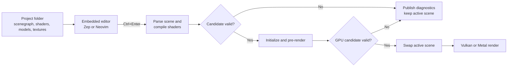

# VkLive research

Research date: 2026-08-18  
Inspected checkout: `D:/dev/vklive` at commit `a6623d0`  
Upstream: <https://github.com/cmaughan/vklive>

## Plain-language description

VkLive is a live-coding IDE for GPU graphics. A project is a folder containing
a small scene description, shader source, models, and textures. The user edits
those files and presses `Ctrl+Enter`; the application builds a replacement
scene and shows it beside the editor.

Its defining feature is failure tolerance. A broken edit produces diagnostics
but does not replace the working GPU scene. The previous successful image keeps
rendering until a complete candidate can be parsed, compiled, initialized, and
pre-rendered successfully.

The repository is named VkLive, while the desktop executable and window title
are `Rezonality`.

## Existing workflow



The implementation uses a worker queue to build a replacement `Project` and
`Scene`. The UI thread pre-renders the candidate, waits for safe GPU state,
destroys the prior scene, copies time/camera state, and installs the new one.
Invalid same-project candidates contribute editor diagnostics without
replacing the current project.

## Project format

A project is a normal directory:

```text
project/
|-- project.toml
|-- default.scenegraph
|-- effect.vert
|-- effect.frag
|-- model.gltf
`-- textures/
```

`project.toml` selects the scenegraph. The scenegraph language declares:

- named surfaces: textures, depth buffers, and render targets;
- cameras;
- model assets and geometry;
- ordered raster, ray-tracing, and scripted passes;
- shaders, samplers, pass targets, and optional ping-pong sampling;
- an optional post-2D scripted stage.

The useful mental model is: draw these objects with these shaders into these
images, then sample those images in later passes.

## Implemented feature inventory

- Vertex, fragment, and geometry shader paths.
- Named textures, render targets, depth targets, and ordered multipass scenes.
- Shader compilation diagnostics and SPIR-V reflection.
- OBJ/glTF loading through Assimp.
- PBR materials and HDR environment rendering.
- Cameras and pane/window-size-relative surfaces.
- Vulkan ray-tracing shaders and a separate native Metal ray-kernel path.
- Audio capture and FFT/waveform data uploaded as the `AudioAnalysis` texture.
- Frame pause, scrubbing, and deterministic PNG-sequence recording.
- Render-target inspection and Vulkan debug names/validation diagnostics.
- Vulkan rendering on Windows/Linux and Metal rendering on macOS.
- Zep and embedded-Neovim editor backends.
- An experimental node-graph canvas that currently displays hard-coded demo
  nodes rather than editing the real scene domain.

## Representative examples

The shipped projects under `run_tree/projects` exercise the transferable
feature set:

| Example | Capability |
|---|---|
| `simple` | Single full-screen shader pass |
| `default` | Texture, offscreen color/depth, model, geometry shader, composite |
| `blend_waves` | Animated full-screen shader |
| `deferred_shading` | Multiple G-buffer targets and lighting composition |
| `pbr_robot` | glTF materials and HDR environment |
| `ray_tracer` | Vulkan ray shader groups plus native Metal ray kernel |
| `shadertoy/audio_spectrum_analysis` | Live audio/FFT texture |
| `shadertoy/protoplanetary_disc` | Multipass ShaderToy-style effect |

## Source map

```text
app/                    SDL/ImGui application and editor orchestration
src/                    Shared scene/model/compiler logic and GPU backends
include/vklive/         Public engine and backend headers
libs/vklive_nvim/       Embedded Neovim process, RPC, model, and renderer
libs/zep/               Alternative embedded editor
libs/zest/              File/process/render/UI support used by VkLive
libs/zing/              Audio capture and analysis
libs/nodegraph/          Experimental node canvas
run_tree/projects/      Shipped projects and templates
run_tree/shaders/       Shared shader includes
run_tree/bin/           Bundled glslangValidator binaries
tests/                  Parser, model, editor, backend, and render-parity tests
```

## Code worth porting

Port with minimal semantic change:

- `src/scene.cpp`, `include/vklive/scene.h`, and the MPC parser;
- `src/shader_compiler.cpp` and shader diagnostic parsing/reflection;
- `src/model.cpp`, `include/vklive/model.h`, and camera logic;
- Vulkan surface, pass, pipeline, model, binding, reflection, and scene code;
- Metal surface, pass, model, shader translation, and scene code;
- representative projects, shared shader includes, and render-parity fixtures;
- audio analysis code needed by the audio example;
- process-launch support needed for the bundled runtime shader compiler.

Prefer compatibility shims for the small Zest file, logging, runtree, timing,
and process calls so that imported renderer/parser sources remain recognizable.

## Code deliberately not ported

- `app/` SDL window and main loop;
- Zep and the VkLive Neovim embedding layer;
- menus, project dialogs, dock layouts, transparent-editor mode, and settings UI;
- ImGui renderer and viewport ownership;
- nodegraph integration and theme editor;
- the render-target inspector and sequencer UI;
- standalone swapchain/drawable creation, submission, and presentation.

Draxul already owns the missing shell: pane layout, terminals/editors, input,
windowing, GPU presentation, plugin discovery, actions, and persistence.

## Important constraints and risks

1. **The original GPU backends own too much.** VkLive creates the device,
   swapchain, command pools, ImGui integration, and presentation. The plugin
   must instead borrow Draxul's device, target, and command buffer and must
   never submit or present.
2. **The original runtime is effectively singleton-oriented.** Global device,
   frame/time, parser, and validation state must become per-plugin-instance or
   immutable shared state so multiple Rezonality panes are safe.
3. **Safe scene replacement is harder inside a host command buffer.** Old GPU
   generations must retire only after the Draxul frame slot that last used
   them has completed.
4. **Runtime shader compilation is a product dependency.** VkLive bundles
   platform `glslangValidator` binaries, compiles GLSL to SPIR-V, and uses
   SPIRV-Cross plus Metal's runtime compiler on macOS. Rezonality must package
   this toolchain with the plugin rather than assume it is on `PATH`.
5. **The README is stale in places.** Current code supports Metal and Neovim,
   although the README still describes a Vulkan/Zep-only application.
6. **Metal feature parity is incomplete.** Geometry shaders require a focused
   compatibility path; arbitrary Vulkan descriptors and Vulkan ray-shader
   groups are not all translated to Metal.
7. **The upstream tracker records active hardening work.** Parser vector
   crashes, render-thread resource lifetime, immutable model hot reload,
   validation thread safety, and capture diagnostics should be addressed while
   their paths are ported rather than copied as accepted defects.

## Product interpretation

The strongest description is:

> ShaderToy crossed with a small render-graph editor and a real Vulkan/Metal
> pipeline, with last-known-good rendering during broken edits.

For Draxul, the editor half is intentionally removed. Rezonality becomes the
fault-tolerant live viewport; Draxul's terminal panes and agents become the
authoring environment.

